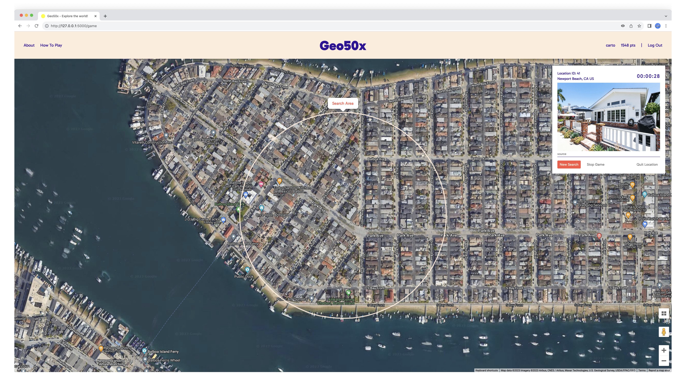
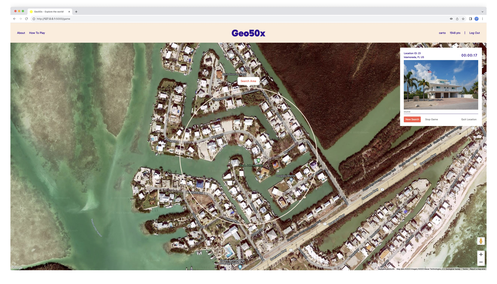
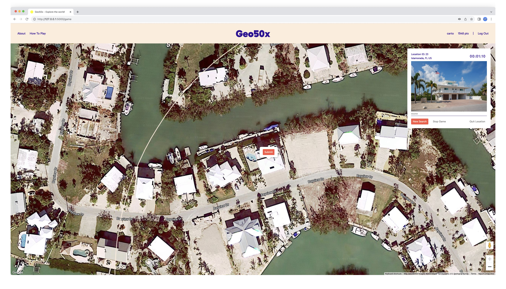
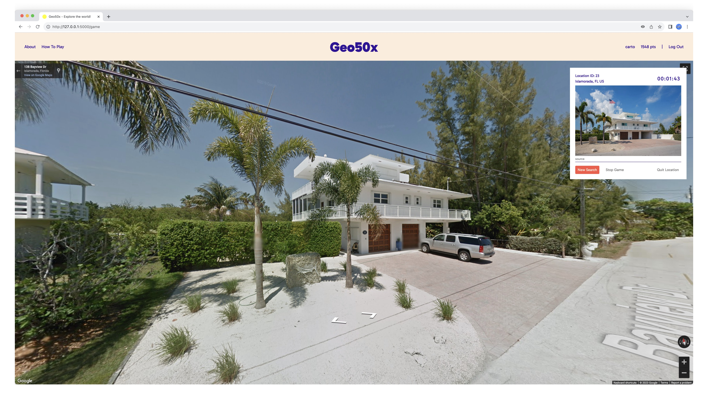
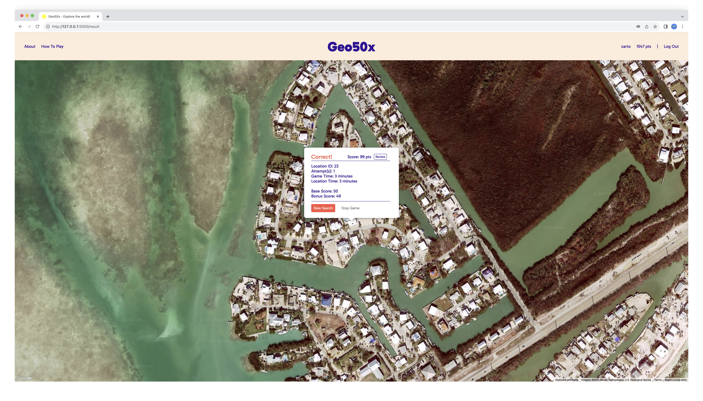
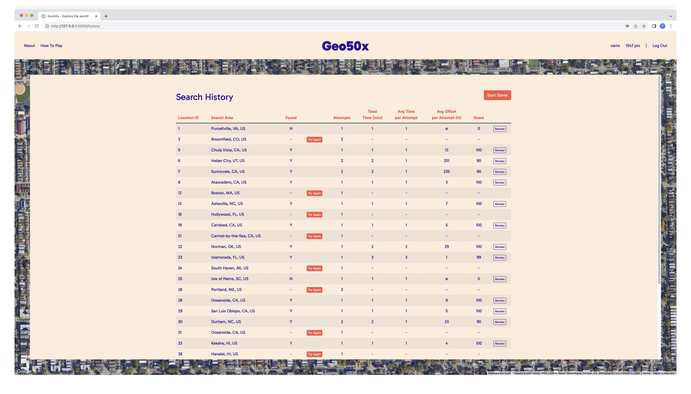

# Geofinder

An online game that's like _Where's Waldo?_ but for houses

## Description

_Geofinder_ is an online carto-architectural scavenger hunt. The gameplay is simple: Given a photo of a house somewhere in the world, you are tasked with locating that house on Google Maps. It's that straighforward, although how you will go about searching might not be.

_Geofinder_ is inspired by such childhood games as _[Where's Waldo?](https://en.wikipedia.org/wiki/Where%27s_Wally%3F)_ and _[Where in the World is Carmen Sandiego?](https://en.wikipedia.org/wiki/Carmen_Sandiego)_. And the simple pleasures of looking out through vehicle windows and just gazing at the passing landscapes and cityscapes.



More screenshots below.

## Disclaimer

ALL CONTENTS IN THIS REPO ARE FOR EDUCATIONAL PURPOSES ONLY.

## Getting Started

### Dependencies

* Flask==2.2.5
* Flask-Session==0.4.1
* Flask_SocketIO==5.3.6
* geographiclib==2.0
* geopandas==0.14.1
* haversine==2.8.0
* psycopg2_binary==2.9.9
* Shapely==2.0.2
* Werkzeug==3.0.1

### Usage

Clone it!

```bash
git clone https://github.com/ggeerraarrdd/geofinder.git
```

Go into the project directory and run the command:

```bash
flask run
```

Open the URL after 'Running on'.

### Notes on Google Maps

For the embedded maps to work, you need to use your own API Key. Before you can create one, you will need to create a Google Cloud project, for which you need a Google Cloud account.

* [Set up a Google Cloud account](https://cloud.google.com)
* [Set up your Google Cloud project](https://developers.google.com/maps/documentation/javascript/cloud-setup)
* [Using API Keys](https://developers.google.com/maps/documentation/javascript/get-api-key)

### Database

TBD

### Environment Variables

TBD

### Logging In

TBD

## Author(s)

* [@ggeerraarrdd](https://github.com/ggeerraarrdd/)

## Version History

### Release Notes

* See [https://github.com/ggeerraarrdd/geofinder/releases](https://github.com/ggeerraarrdd/geofinder/releases)

### Initial Release

The [initial realease](https://github.com/ggeerraarrdd/geofinder/releases/tag/v1.0.0) of _Geofinder_, as _Geo50x_, was submitted as the final project for [CS50x: Introduction to Computer Science](https://cs50.harvard.edu/x/2023/) (HarvardX, 2023). Read the [project brief](https://cs50.harvard.edu/x/2023/project/) as of September 2023.

### Future Work

Improvements and new features development are ongoing.

* Add functionalities to Search History page such as ~~reviewing submitted locations~~ _(Update Nov 2, 2023: Done)_ and ~~more easily re-try locations attempted but not yet found~~ _(Update Nov 2, 2023: Done)_. 
* ~~Add administration interface for data management~~. _(Update Jan 8, 2024: Done)_
* Deploy app on AWS EC2.

## License

* [MIT License](https://github.com/ggeerraarrdd/geofinder/blob/main/LICENSE)

## Acknowledgments

* The distribution code for CS50's Finance problem served as a template for the app.
* The documentions for the Google Maps Platform were a daily, often hourly, read.
* Too many StackOverflow [Q&As](https://meta.stackoverflow.com/questions/267822/if-stack-overflow-doesnt-have-threads-what-the-heck-should-they-be-called) and Medium articles to mention but a couple proved immensely useful in developing two key functions
  * [Offset Latitude and Longitude by some meters accurately - Reverse Haversine](https://gis.stackexchange.com/questions/411859/offset-latitude-and-longitude-by-some-meters-accurately-reverse-haversine)
  * [Algorithm for offsetting a latitude/longitude by some amount of meters](https://gis.stackexchange.com/questions/2951/algorithm-for-offsetting-a-latitude-longitude-by-some-amount-of-meters)
* The folks at CS50 for a mind-altering course.

## Screenshots






